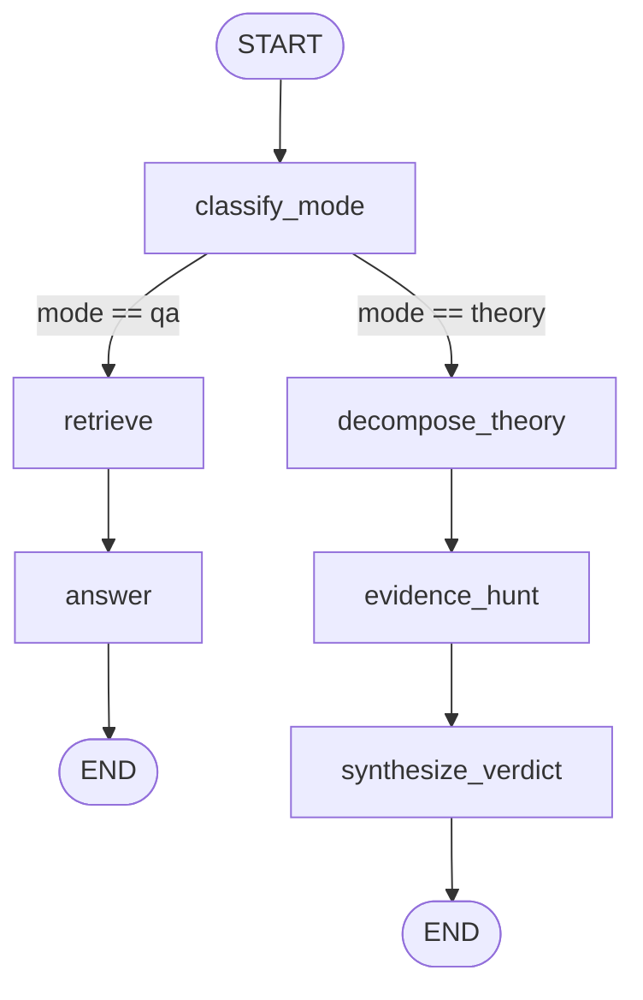

# 04 — Theory Verification Mode (Phase 3)

## What this is

Phase 3 adds a **second graph path** for fan theories and speculative questions. The agent still uses one CLI entry point (`python backend/cli.py`) — there is no mode toggle. The HTTP API (`uvicorn main:app`) routes the same way. The first node, `classify_mode`, inspects the question text and routes either to the existing QA flow or to a new theory pipeline.

| Question type | Example | Path |
|---------------|---------|------|
| Factual / QA | "What is Zoro's bounty?" | `classify_mode` → `retrieve` → `answer` |
| Theory / opinion | "Theory: Bonney is Kuma's daughter" | `classify_mode` → `decompose_theory` → `evidence_hunt` → `synthesize_verdict` |

Theory mode does **not** call the `answer` node. It produces a structured **verdict** (`SUPPORTED`, `CONTRADICTED`, or `INSUFFICIENT`) plus a cited explanation in `answer` (same field the CLI prints).

**Prerequisite:** Phase 2 RAG gate (≥9/10 on `python -m rag.eval`) and a built Chroma index. Theory mode reuses `rag.retriever.retrieve` — it does not change indexing or retrieval logic.

---

## Graph overview



ASCII equivalent:

```
user question
     │
     ▼
[classify_mode] ──mode=qa────► [retrieve] ──► [answer] ──► END
     │
     └──mode=theory──► [decompose_theory] ──► [evidence_hunt] ──► [synthesize_verdict] ──► END
```

Entry point: **`classify_mode`** (replaces the old direct `retrieve` entry).

Defined in `backend/agent/graph.py` via `build_graph()`. `build_graph_no_rag()` is unchanged — it still runs `answer` only for LLM-only baselines.

---

## State (`AgentState`)

Defined in `backend/agent/state.py`. Phase 3 adds four optional keys; Phase 2 fields are unchanged.

| Field | Set by | Used on path | Description |
|-------|--------|--------------|-------------|
| `question` | Caller | Both | User input (required in practice) |
| `context` | `retrieve_node` | QA | Retrieved chunks for factual answers |
| `answer` | `answer` or `synthesize_verdict` | Both | Final text shown to the user |
| `mode` | `classify_mode` | Both | `"qa"` or `"theory"` |
| `sub_questions` | `decompose_theory` | Theory | 2–4 verifiable sub-questions |
| `evidence` | `evidence_hunt` | Theory | Wiki chunks tagged per sub-question |
| `verdict` | `synthesize_verdict` | Theory | `SUPPORTED` \| `CONTRADICTED` \| `INSUFFICIENT` |

```python
class AgentState(TypedDict, total=False):
    question: str
    context: list[dict]
    answer: str

    mode: str
    sub_questions: list[str]
    evidence: list[dict]
    verdict: str
```

LangGraph merges partial dicts returned by each node. Theory runs may leave `context` empty; QA runs leave `sub_questions`, `evidence`, and `verdict` unset.

---

## Mode classification (`classify_mode`)

**File:** `backend/agent/nodes.py`

Rule-based — no LLM. The question is lowercased; if **any** substring from `THEORY_TRIGGERS` appears, `mode` is `"theory"`, otherwise `"qa"`.

| Trigger phrase |
|----------------|
| `is it possible` |
| `could it be` |
| `do you think` |
| `theory:` |
| `theory about` |
| `is the theory` |
| `do you believe` |
| `what if` |
| `might be` |
| `could be related` |
| `is secretly` |
| `actually a` |
| `is actually` |
| `could luffy` |
| `could zoro` |
| `is imu` |

**Examples:**

- `"What is Luffy's devil fruit?"` → `qa` (no trigger)
- `"Theory: Luffy is Joy Boy"` → `theory` (`theory:`)
- `"Is it possible Shanks works for the World Government?"` → `theory` (`is it possible`, `is secretly`)

To extend classification, add phrases to `THEORY_TRIGGERS` in `nodes.py`. A future phase could replace this with an LLM classifier without changing graph structure.

---

## Theory path nodes

### 1. `decompose_theory`

**Purpose:** Turn one vague theory into 2–4 **factual** sub-questions that wiki retrieval can answer.

**Mechanism:** Single LLM call (`get_llm()`), system prompt asks for a numbered list. Output is parsed by `_parse_sub_questions()`:

- Split on newlines
- Strip leading `1. ` / `2) ` style prefixes via regex `^\d+[\.\)]\s*`
- Keep at most **4** items

**Writes:** `sub_questions: list[str]`

If the LLM returns malformed text, you may get fewer than 2 sub-questions; `evidence_hunt` still runs over whatever was parsed.

---

### 2. `evidence_hunt`

**Purpose:** Gather wiki evidence for each sub-question.

**Mechanism:** Plain Python `for` loop — **not** a LangGraph loop node. Bounded by sub-question count (≤4).

```python
for sub_q in state.get("sub_questions", []):
    for chunk in retrieve(sub_q, k=3):
        # append tagged evidence
```

Each `retrieve()` call uses the full Phase 2 pipeline (alias expansion, Chroma query, lexical rerank, diversify). **`k=3`** per sub-question (QA path uses default `k=10` on the main question).

**Writes:** `evidence: list[dict]`

**Evidence item shape:**

```python
{
    "sub_question": str,   # which sub-question this chunk supports
    "text": str,
    "source": str,         # wiki page stem, e.g. "bonney"
    "heading": str,        # section heading
    "score": float,        # rerank score from retriever
}
```

---

### 3. `synthesize_verdict`

**Purpose:** Read grouped evidence and emit a verdict + cited explanation.

**Context assembly:**

1. Group `evidence` by `sub_question`
2. Per sub-question: take up to **2** chunks, truncate each to **800** chars (`VERDICT_CHUNK_MAX_CHARS`)
3. Format blocks as `Sub-question: …` + `[Source: stem — heading]` excerpts

**LLM:** System prompt defines verdict meanings and required output format. Human message is the original theory question.

**Verdict definitions (prompt):**

| Verdict | Meaning |
|---------|---------|
| `SUPPORTED` | Wiki explicitly confirms a key element of the theory |
| `CONTRADICTED` | Wiki explicitly contradicts a key element |
| `INSUFFICIENT` | Not enough confirmed evidence; speculation or unconfirmed |

**Extraction:** `_extract_verdict()` scans the LLM response (uppercased):

1. If `SUPPORTED` appears → `SUPPORTED`
2. Else if `CONTRADICTED` appears → `CONTRADICTED`
3. Else → `INSUFFICIENT`

Order matters: if both `SUPPORTED` and `CONTRADICTED` appear in prose, `SUPPORTED` wins. The prompt asks for a single line `Verdict: …` to reduce ambiguity.

**Expected LLM format:**

```
Verdict: SUPPORTED

[2-3 sentence explanation with citations]

Supporting evidence: (Source: bonney — Background), (Source: kuma — History)
```

**Writes:** `verdict: str`, `answer: str` (full LLM response text)

The CLI prints `answer` only. Inspect `verdict` in checkpoints or eval output for the structured label.

---

## QA path (unchanged behavior)

`retrieve_node` and `answer` were **not modified** in Phase 3.

- `retrieve_node` → `retrieve(state["question"])` with default `k=10`
- `answer` → RAG grounding rules, `CHUNK_MAX_CHARS=1500` per chunk

QA questions never run `decompose_theory`, `evidence_hunt`, or `synthesize_verdict`.

---

## End-to-end example (theory)

**Input:**

```
Theory: Jewelry Bonney is Bartholomew Kuma's biological daughter
```

**Checkpoint sequence (typical):**

| Step | Node | State keys updated |
|------|------|-------------------|
| 1 | `classify_mode` | `mode: "theory"` |
| 2 | `decompose_theory` | `sub_questions: […]` |
| 3 | `evidence_hunt` | `evidence: […]` |
| 4 | `synthesize_verdict` | `verdict: "SUPPORTED"`, `answer: "Verdict: SUPPORTED\n…"` |

**CLI output:** The `answer` field (includes verdict line and citations).

---

## Files changed in Phase 3

| File | Change |
|------|--------|
| `backend/agent/state.py` | Added `mode`, `sub_questions`, `evidence`, `verdict` |
| `backend/agent/nodes.py` | Added 4 nodes + helpers; QA nodes untouched |
| `backend/agent/graph.py` | `build_graph()` conditional routing; `build_graph_no_rag()` unchanged |
| `backend/evals/theory_eval.py` | **New** — 5-question theory gate |
| `backend/evals/__init__.py` | **New** — package marker for `python -m evals.theory_eval` |

**Not modified (by design):**

- `backend/rag/retriever.py`
- `backend/rag/index.py`
- `backend/rag/eval.py`
- `backend/api/routes.py` and `backend/cli.py` (both use `build_graph()`)

---

## Evaluation (`theory_eval`)

**Run from backend directory:**

```bash
cd backend
python -m evals.theory_eval
```

**Gate:** ≥ **3/5** full passes (`P`) before Phase 4.

**Scoring** (`score_theory`):

- Combines `verdict` + `answer` into one string for checks
- **Verdict pass:** `expected_verdict` substring appears (case-insensitive)
- **Mention pass:** every string in `must_mention` appears (case-insensitive)
- `P` = both pass | `~` = one pass | `X` = neither

| # | Question (summary) | Expected verdict | Must mention |
|---|-------------------|------------------|--------------|
| 1 | Bonney is Kuma's daughter | SUPPORTED | bonney, kuma |
| 2 | Roger had a devil fruit | CONTRADICTED | roger |
| 3 | Shanks secretly works for WG | INSUFFICIENT | shanks |
| 4 | Luffy is Joy Boy reincarnation | SUPPORTED | luffy, joy boy |
| 5 | Im-sama + Ope Ope immortality | INSUFFICIENT | im |

Uses the same `SqliteSaver` + `build_graph()` as the CLI. Each question gets a fresh `thread_id`.

---

## CLI usage

From repo root (unchanged):

```bash
python backend/cli.py "What is Zoro's bounty?"
python backend/cli.py "Theory: Gol D. Roger had a devil fruit power"
```

Routing is automatic. The CLI does not print `verdict` or `mode` today — use the API response or `checkpoints.sqlite` to inspect them.

---

## Inspecting theory runs in checkpoints

After a theory question, `checkpoints.sqlite` contains one row per node. Useful fields per step:

- After `classify_mode`: `mode`
- After `decompose_theory`: `sub_questions`
- After `evidence_hunt`: `evidence` (length, sources)
- After `synthesize_verdict`: `verdict`, `answer`

Use [langgraph-replay](https://github.com/langchain-ai/langgraph) or a SQLite browser on `backend/checkpoints.sqlite`.

---

## Troubleshooting

| Problem | Symptom | Likely cause | Fix |
|---------|---------|--------------|-----|
| Theory question answered like QA | Short factual answer, no "Verdict:" | No trigger phrase matched | Rephrase with `Theory:` or `What if`; or add trigger to `THEORY_TRIGGERS` |
| Always INSUFFICIENT | Verdict never SUPPORTED/CONTRADICTED | Weak retrieval or LLM hedging | Re-run `python -m rag.index`; check `evidence` in checkpoints |
| Empty `sub_questions` | No evidence gathered | LLM list parse failed | Check decompose output in checkpoint; tighten prompt |
| Eval errors on import | `ModuleNotFoundError` | Run from `backend/` or missing deps | `pip install -r requirements.txt` from `backend/` |
| Chroma errors in theory path | Exception in `evidence_hunt` | Index not built | `python -m rag.scrape` then `python -m rag.index` |
| Wrong verdict keyword | `verdict` disagrees with prose | `_extract_verdict` substring match | Ensure response contains exactly one dominant verdict word |

---

## Design decisions

1. **Rule-based classifier first** — Fast, deterministic, no extra LLM cost. Good enough for eval questions that use explicit theory phrasing.

2. **Bounded loop inside `evidence_hunt`** — LangGraph conditional edges handle QA vs theory; sub-question iteration stays in one node to avoid graph complexity for 2–4 iterations.

3. **`answer` shared across paths** — CLI and API (Phase 4) can always read `answer`; `verdict` is additive metadata for theory.

4. **Smaller `k` per sub-question** — Theory runs 2–4 retrievals × k=3; keeps latency and context size manageable vs one k=10 call on the full theory.

5. **RAG stack frozen** — Phase 3 only changes agent routing and prompts; retrieval quality improvements stay in Phase 2 modules.

---

## Related docs

- [01 — Agent Graph](./01-agent-graph.md) — LangGraph basics, checkpoints, LLM selection (updated for Phase 3 entry point)
- [02 — RAG Pipeline](./02-rag-pipeline.md) — Scrape, index, retrieve (used by both paths)
- [03 — RAG Implementation](./03-rag-implementation.md) — Grounding rules, Phase 2.5 eval gate
- Plan spec: `plans/op-companion-phase-3-theory.md` (workspace root)
- Next phase: `plans/op-companion-phase-4-api.md`
